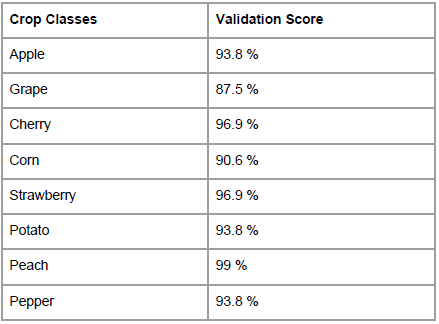
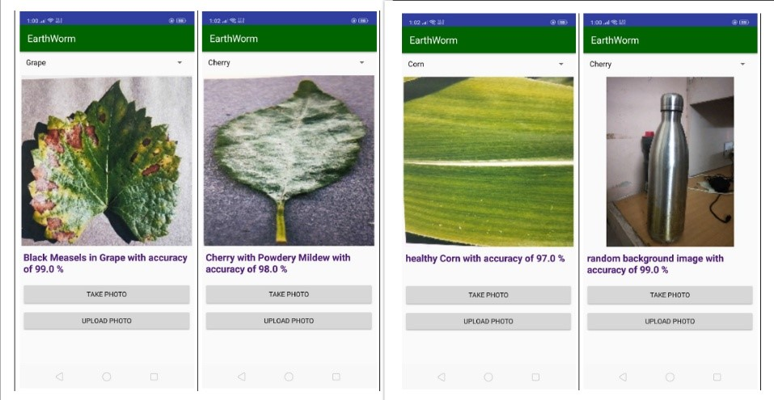

# EarthwormAPI

__Disclaimer__: _This project is no longer maintained and may contain outdated/vulnerable dependencies.__  

This is the API code for project __Earthworm__ made as a part of 7th Semester project by _Aurobindo Debnath_ and his colleagues in the year 2018.  
The API is coded in Django REST Framework which is a web development framework for Python.

## About the Project - Earthworm
__Project - Earthworm__ is a plant disease detection android application that can classify diseases in plants by analyzing the picture of the leaves uploaded on it by the user.  
Additionally, the app also shows weather forecast results and news/blogs related to agriculture to assist to farmers using this application to take required actions.

## Dataset and Accuracy
It is trained on a subset of the _PlantVillage_ Dataset.  
The accuracy chart on various classes are below:  

## Final Product glimpse
The application could predict diseases in plants and shows confidence score for the same.  
  
  

## Additional Information
Download/Read the full project report in PDF format from [here](https://drive.google.com/file/d/1dCLr25xRreN5GT5WRHkIuGQGNheJQ6YP/view)
